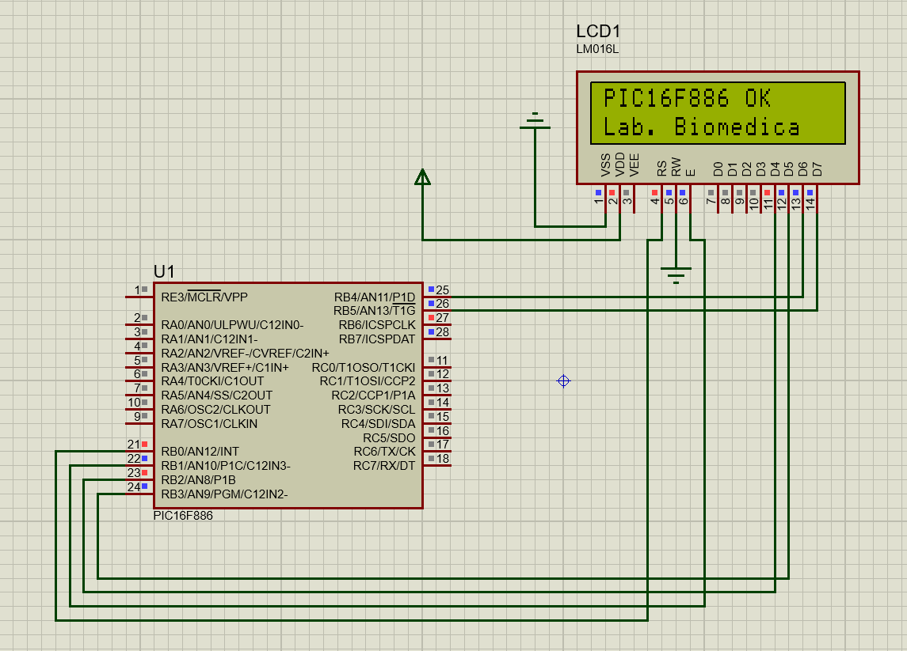
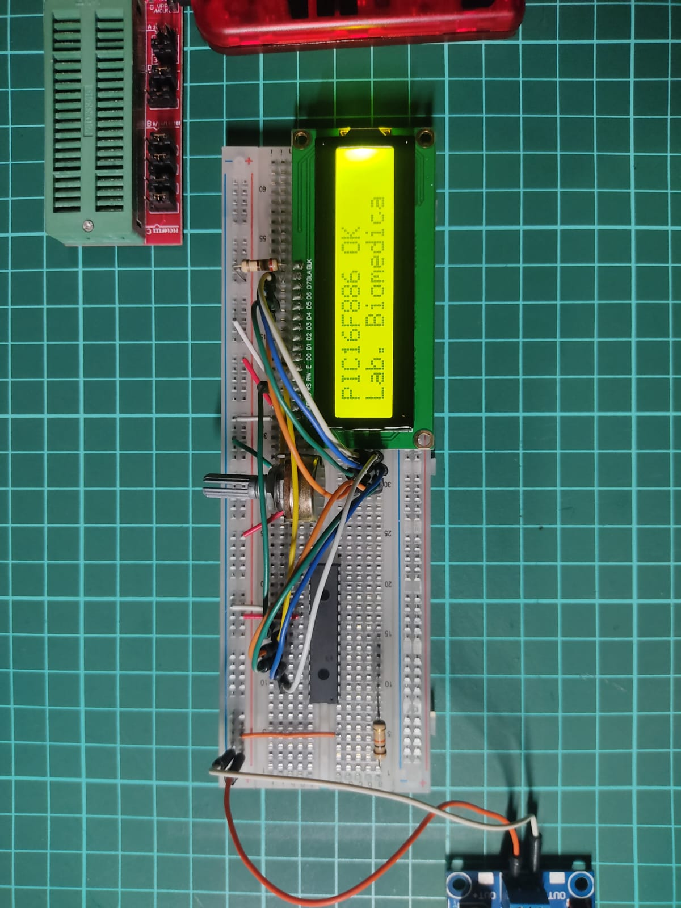

# Interface de Control LCD 16x2 con PIC16F886 (Modo 4-bits)

Este repositorio contiene la implementación técnica de una interfaz de control para pantallas LCD de 16x2 utilizando el microcontrolador **PIC16F886**. El proyecto incluye el código fuente en C, la simulación en Proteus y la validación en hardware real, demostrando un flujo de trabajo completo de sistemas embebidos.

## 🛠️ Especificaciones Técnicas
- **Microcontrolador:** Microchip PIC16F886.
- **Reloj:** Oscilador interno a 4MHz.
- **Compilador:** MPLAB XC8 v2.xx.
- **Protocolo:** Bus de datos de 4 bits para optimización de I/O.
- **Entorno de Simulación:** Proteus 8.xx.

## ⚙️ Configuración de Hardware
Para la implementación física, se han seguido estándares de diseño para garantizar la estabilidad del sistema:
- **MCLR (Pin 1):** Resistencia de pull-up de 10kΩ a VDD para evitar reinicios involuntarios.
- **LCD Backlight:** Resistencia de limitación de 220Ω en el Ánodo (Pin 15) para protección del LED de fondo.
- **Contraste:** Potenciómetro de 10kΩ en V0 (Pin 3).

### Asignación de Pines (Pinout)
| LCD Pin | Función | PIC Pin (PORTB) |
| :--- | :--- | :--- |
| RS | Register Select | RB0 |
| EN | Enable | RB1 |
| D4 | Data Bit 4 | RB2 |
| D5 | Data Bit 5 | RB3 |
| D6 | Data Bit 6 | RB4 |
| D7 | Data Bit 7 | RB5 |

## 💻 Lógica del Firmware
El código fuente implementa una secuencia de inicialización robusta basada en los tiempos críticos del controlador Hitachi HD44780. 
- **Modo 4 bits:** Permite controlar el display utilizando solo 6 pines de I/O del microcontrolador.
- **Funciones incluidas:** Inicialización, envío de comandos, escritura de caracteres individuales y cadenas de texto (`strings`), y posicionamiento dinámico del cursor.

## 🧪 Validación y Resultados

### Simulación (Proteus)
Se verificó la lógica de control y los tiempos de ejecución mediante simulación digital.

### Implementación Física
Validación exitosa en hardware real utilizando una fuente de alimentación regulada de 5V DC.

## 📂 Estructura del Proyecto
- `/src`: Código fuente original en C (`main.c`).
- `/simulation`: Archivo de diseño y simulación en Proteus.
- `/bin`: Archivo ejecutable `.hex` listo para programar.
- `/docs`: Documentación visual y evidencias de funcionamiento.

---
**Desarrollado como parte del Laboratorio de Ingeniería Biomédica 2026.**
